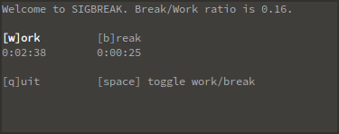

# SIGBREAK
SIGBREAK is a console-based timer that helps you stay focused and productive by
allowing you to balance the time you work and take breaks. It is based on the
[Pomodoro technique](https://en.wikipedia.org/wiki/Pomodoro_Technique), but
unlike traditional Pomodoro timers, SIGBREAK doesn't interrupt your thought process
with fixed breaks. Instead, it lets you switch between work and
break modes freely, while still ensuring that you take breaks for a
fraction of the time you've worked.

This project is under active development. Expect bugs and incompatibilities.

## Usage
Install [Python 3](https://www.python.org/). Then simply run `python
sigbreak.py` in your favorite terminal (tested on
[rxvt-unicode](http://software.schmorp.de/pkg/rxvt-unicode.html)).
